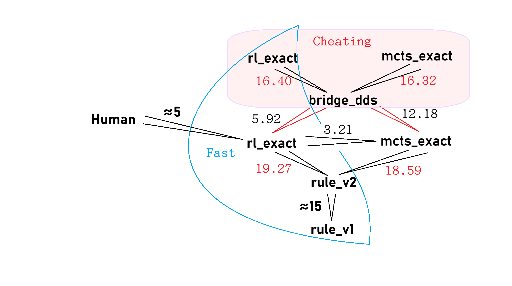
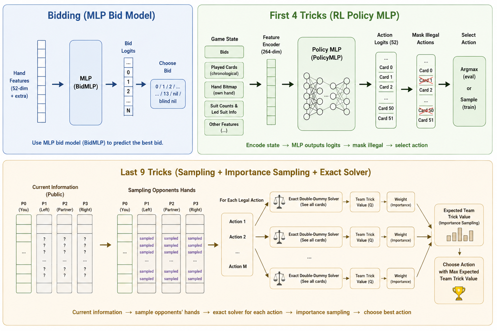

# Spades AI

<p align="center">
  <a href="Towards%20Lightweight%20Human%20Level%20AI%20in%20Spades.pdf">
    
  </a>
  <br>
  <a href="Towards%20Lightweight%20Human%20Level%20AI%20in%20Spades.pdf">
    
  </a>
</p>

A Spades card game AI with reinforcement learning (RL), exact double-dummy solving, and a web-based GUI. The project trains an RL policy network (MLP) for the first 4 tricks of each hand and uses an exact solver for the remaining cards. Bidding is handled by a separate MLP model from the GO-MCTS submodule.

## Paper Abstract

Developing human-level AI for trick-taking games like Spades is notoriously challenging due to massive imperfect-information state spaces and non-linear scoring dynamics. Pure search methods struggle with combinatorial explosion, while end-to-end deep reinforcement learning often fails to execute precise logical reasoning in the endgame. In this paper, we propose a lightweight, two-stage AI architecture that elegantly bridges these paradigms. We decompose the game into an early phase, handled by a bid-conditional neural policy trained via variance-reduced REINFORCE, and an endgame phase, governed by a highly optimized, sample-based exact solver. Furthermore, we employ Neural Fictitious Self-Play (NFSP) combined with heuristic rules to build a robust bidding model. Evaluations demonstrate that our hybrid approach outperforms traditional search-based and rule-based baselines and achieves human-level performance against skilled human players. Remarkably, our architecture is computationally highly efficient: it executes actions in under 5 seconds on a single CPU core, and the reinforcement learning policy converges in just 20 minutes of training.



## Detailed Rules of Spades (Beginner-Friendly)

Spades is a popular 4-player, trick-taking card game played in two partnerships. This AI project uses a specific scoring variant to encourage exact bidding. Here is how to play:

### 1. Basic Setup
- **Players:** 4 players in 2 teams. Partners sit opposite each other.
- **Deck:** A standard 52-card deck is used. Cards rank from highest to lowest: **A, K, Q, J, 10, 9, 8, 7, 6, 5, 4, 3, 2**.
- **Trump Suit:** The **Spades (♠)** suit is always the trump suit. A Spade will beat any card from the other three suits.
- **Dealing:** All 52 cards are dealt so each player starts with exactly 13 cards.

### 2. The Bidding Phase
Before any cards are played, each player evaluates their hand and bids the number of "tricks" (rounds) they expect to win.
- **Normal Bid:** You can bid any number from 1 to 13. Your bid and your partner's bid are added together to form a **Team Contract** (e.g., if you bid 3 and your partner bids 4, your team must win exactly 7 tricks).
- **Nil Bid (0 Tricks):** You can bid 0 (Nil), meaning you promise to win *exactly zero* tricks. This is a high-risk, high-reward move and is scored completely independently of your partner's bid.

### 3. The Playing Phase
The game is played in 13 rounds, called "tricks." In each trick, all four players play exactly one card.
- The player to the dealer's left leads first. A Spade cannot be led until
  Spades have been broken, unless the leader holds only Spades. Playing any
  Spade, including such a forced lead, breaks Spades for the rest of the hand.
- **Following Suit:** You **must** follow the suit that was led if you hold a card of that suit. (e.g., if Hearts are led, you must play a Heart if you have one).
- **Trumping:** If you don't have a card of the led suit, you can play a Spade (trump) to win the trick, or discard any other suit to lose it.
- **Winning the Trick:** The highest Spade played wins. If no Spades are played, the highest card of the led suit wins. The winner of the trick leads the first card for the next trick.

### 4. Scoring (Immediate "No-Bags" Rule)
In traditional Spades, winning more tricks than you bid (called "bags" or "overtricks") only hurts you after you accumulate 10 of them across several games. To encourage our AI to play with extreme precision, this project uses a stricter **immediate no-bags penalty**:

Let $B$ be your team's total bid, and $T$ be the total tricks actually won.
- **Successful Contract ($T \geq B$):** You earn $10 \times B$ points for meeting your bid. However, you immediately lose 9 points for **every** overtrick. Your final score is: $10B - 9(T - B)$.
- **Failed Contract ($T < B$):** You failed to reach your target. Your team is penalized and loses $10 \times B$ points.
- **Nil Bid Scoring:** If you bid Nil and successfully win 0 tricks, your team gets a $+50$ point bonus. If you fail and win 1 or more tricks, you get a $-50$ point penalty. (Your partner's bid is scored separately).

**The Objective:** For all AI experiments, the goal of each team is to maximize their own team's score *minus* the opponent team's score.

---

## Part 1: Quick Start

### Dependencies

- **Python** >= 3.10 (developed on 3.13)
- **PyTorch** >= 2.0 (`torch`, `torch.nn`, `torch.optim`)
- **NumPy**, **tqdm**
- **transformers** (for the collaborator GPT-2 policy/value model)
- **TensorBoard** (`torch.utils.tensorboard`) for training logging
- **Node.js** >= 20 (for the GUI frontend)
- **A C++17 compiler** (`clang++` or `g++`) — required when a verified native
  double-dummy binary for the current source and platform is unavailable.
  macOS/Linux usually already ship one; **Windows does not**, so install one
  explicitly (see below).

A typical install:

```bash
pip install torch numpy tqdm transformers tensorboard
```

#### C++ compiler (native solver)

The fastest exact solver is C++ compiled to a shared library and loaded via
`ctypes`. The repo ships prebuilt binaries for `darwin_arm64` and
`linux_x86_64` (see `trick_taking/solvers/*.so`). Before the main process loads
one, the loader (`trick_taking/solvers/native_lib_loader.py`) checks it in an
isolated child process for the exact source/recipe Build ID, ABI version, and
required symbols. A verified prebuilt is copied to the ignored,
content-addressed `trick_taking/solvers/__pycache__/native/` cache and loaded
from that version-unique path.

An old, incomplete, corrupt, or wrong-platform binary is never used. The
loader instead compiles `exact_double_dummy_cpp_fastest_core.cpp` and validates
the result before atomically installing it in the versioned cache. This also
happens on platforms without a repository prebuilt, notably Windows. That
fallback needs a compiler on `PATH`; otherwise the diagnostic begins with:

```
failed to build verified native library ...
```

Install one for your platform:

- **macOS:** `xcode-select --install` (provides `clang++`).
- **Linux:** `sudo apt install build-essential` (provides `g++`).
- **Windows:** install **MinGW-w64** (provides `g++`) and add its `bin/` to
  `PATH`. Easiest routes:
  - via [MSYS2](https://www.msys2.org/): `pacman -S mingw-w64-ucrt-x86_64-gcc`,
    then add `C:\msys64\ucrt64\bin` to `PATH`; or
  - via Chocolatey: `choco install mingw`; or
  - via `winget install BrechtSanders.WinLibs.POSIX.UCRT`.

  Verify with `g++ --version` in a fresh terminal. On first run the solver
  compiles a Build-ID-qualified Windows binary under
  `trick_taking/solvers/__pycache__/native/` and reuses it while its source,
  ABI, required symbols, platform, and compile recipe remain unchanged.

Troubleshooting：

Installing nvm:

```bash
curl -o- https://raw.githubusercontent.com/nvm-sh/nvm/v0.40.3/install.sh | bash
```

reopen the terminal

```bash
nvm install 20
nvm use 20
```


### GUI — Play Against the AI

Terminal 1 — Python AI backend:

```bash
python gui/backend.py --port 8001 --exact-threshold 36
```

Terminal 2 — Web dev server:

```bash
cd gui && npm install && npm run dev
```

Then open **http://localhost:5173/** in a browser.

The backend uses `Spades_AI_GO-MCTS/checkpoints/bid_residual_100k.pt` as the
production **acting bidder** with deterministic calibration `(lambda=1, T=0,
epsilon=0, rho=1)`. The original `bid_nsfp.pt` remains frozen for late-play IS
belief weighting and as the acting bidder's per-decision fallback. Startup
fails if the selected checkpoint, model ID, config, NSFP model, or frozen play
pipeline hashes do not match.

### Evaluation — rl_exact vs DDS

```bash
python rl/eval_rl_multicpu.py --num-games 1500 --seed 61 --num-workers 30 \
    --load-checkpoint ./rl_checkpoints/best.pt
```

Other evaluation modes:

```bash
# DDS vs MCTS (cheating AIs, both see all cards)
python evaluate/evaluate_dds_vs_mcts.py --num-games 128 --num-workers 32

# RL-Exact vs DDS (the main evaluation)
python evaluate/evaluate_dds_vs_rl.py --num-games 128 --num-workers 32

# Rule-Based-First4 vs DDS
python evaluate/eval_rule_first4_multicpu.py --num-games 1500 --num-workers 30
```

### Training — Policy Gradient (Reinforcement Learning)

**Pre-training** (from scratch):

```bash
python rl/pretrain_rl_multicpu.py --num-games 20000 --seed 42 --lr 0.001 \
    --num-workers 32 --update-interval 120 --num-epochs 1 --entropy-coef 0.05
```

**Full RL training** (continues from a pretrained checkpoint):

```bash
python rl/train_rl_multicpu.py --num-games 100000 --seed 114514 --lr 0.000001 \
    --num-workers 30 --update-interval 300 --num-epochs 1 \
    --load-checkpoint ./rl_checkpoints/pretrain/pretrain_best.pt
```

Monitor training:

```bash
tensorboard --logdir runs/rl_train --port 6011
```

**Nil-specific training:**

```bash
python rl/nil_rl_multicpu.py --num-games 500000 --seed 42 --lr 0.0001 \
    --num-workers 32 --update-interval 300 --num-epochs 1 --entropy-coef 0.05
```

Both rl_exact players share the same policy network parameters during training. Training uses a **team match** format (see Part 2).

---

## Part 2: rl_exact Player — How It Works

### Overview

`RLExactPlayer` ([rl/rl_exact_player.py](rl/rl_exact_player.py)) uses two strategies depending on how many cards remain:

1. **Policy network** (first ~16 cards, i.e. remaining > `exact_threshold=36`): an MLP outputs logits over all 52 cards; the highest-scoring legal card is selected (argmax during evaluation, sampled during training).
2. **Exact solver** (last ~36 cards, i.e. remaining <= `exact_threshold`): the double-dummy solver from the DDS library sees all hands (via importance-sampling determinization of opponent hands from public info) and picks the card that maximizes the team's trick total.

### Card-Playing Flow

```
play_card(legal_cards, state_view)
  │
  ├─ remaining = sum(len(h) for h in state.hands)   # cards left in all hands
  │
  ├─ remaining <= exact_threshold (36)?
  │     └─ YES → _exact_play()
  │              Use ExactDoubleDummyCppFastestSolver.
  │              For each legal card, run DDS on each possible
  │              opponent-hand determinization, average the trick counts,
  │              pick the card with the highest expected tricks.
  │
  └─ NO → _policy_play()
           Encode the current state (264-dim feature vector via RLFeatureEncoder).
           Run through PolicyMLP → 55 logits (one per card).
           Mask illegal actions → softmax → pick argmax (eval) or sample (train).
```

### Bidding

Bidding uses the **MLPBidPlayer** from the GO-MCTS bridge ([evaluate/GO-MCTS/models.py](evaluate/GO-MCTS/models.py)), which wraps `BidMLP` (a small MLP trained on double-dummy data). The checkpoint is `Spades_AI_GO-MCTS/checkpoints/bid_nsfp.pt`. If the checkpoint is unavailable, bidding falls back to a heuristic based on hand strength.

### Checkpoint Switching (Nil)

The player automatically switches between two policy checkpoints based on the actual bids:
- **No nil bid** → use `55_2.pt` (non-nil policy)
- **Someone bids nil/blind_nil** → use `55_2nil.pt` (nil-specific policy)

This is because nil contracts fundamentally change the optimal play (the nil bidder must avoid taking tricks).

### Team-Match Training (for RL)

During training, both rl_exact players (seats 0+2 or 1+3) use the same shared policy network. Each training iteration plays two games of the same deal with swapped seats, and the reward is:

```
reward = (score_rl_exact_team - score_dds_team)_game1
       + (score_rl_exact_team - score_dds_team)_game2
```

This cancels out the advantage of a specific deal, giving a pure signal about the policy's relative strength vs DDS.

### PolicyMLP Architecture

```
Input:  264-dim feature vector (RLFeatureEncoder)
        ├─ Part 1 (164 dims): bids, played cards (chronological), hand bitmap,
        │                     per-suit counts, led-suit tracking
        └─ Part 2 (100 dims): 10 base features repeated 10× each
                (play position, partner status, legal follow options, nil bids)

Hidden: [1024, 512, 512] with ReLU activations
Output: 55 logits (52 card IDs + 3 special actions)

Training: policy gradient (REINFORCE) with:
  - entropy bonus for exploration
  - advantage normalization across a batch
  - Adam optimizer
```

---

## Part 3: Repository Structure

### Top-Level Directories

```
trick_taking/        Core card-game engine (framework)
strategy/            AI player strategies (MCTS, rule-based, exact)
rl/                  Reinforcement learning training & evaluation
evaluate/            Evaluation scripts and GO-MCTS bridge
gui/                 Web-based UI (React + Vite + Python backend)
data/                Dataset generation utilities
mlp/                 DoubleDummyMLP class (used by MCTS prior)
external/            DDS bridge (cdds / dds-bridge) C library + Python wrapper
Spades_AI_GO-MCTS/   GO-MCTS collaborator submodule (now a regular directory)
```

### [`trick_taking/`](trick_taking/) — Game Engine Foundation

| File | Purpose |
|------|---------|
| `card.py` | `Card`, `Suit`, `Rank` with `card_id` (0-51) encoding and bitmask helpers |
| `deck.py` | Standard 52-card deck (`STANDARD_52`) |
| `game_state.py` | Mutable `GameState` with hands, bids, tricks, phase, `get_player_view()` |
| `game_rules.py` | Abstract rules interface |
| `driver.py` | Game loop — deals, manages phases, calls players |
| `knowledge.py` | Knowledge state for imperfect-information players |
| `player.py` | `AIPlayer` abstract base class |
| `games/spades.py` | Spades rule implementation (`playable()` for legal moves) |
| `players/random_player.py` | Random legal-move player (baseline) |
| `players/human_player.py` | Interactive console player |
| `solvers/` | Double-dummy solver wrappers (DDS C library via ctypes) |
| `utils/feature_encoder.py` | Feature encoder for the old DoubleDummyMLP model |
| `utils/state_tools.py` | State serialization helpers |

**Run tests:**
```bash
python -m pytest trick_taking/tests/
```

### [`strategy/`](strategy/) — AI Player Strategies

| File | Purpose |
|------|---------|
| `truncated_mcts_strategy.py` | MCTS with exact-solver leaf evaluation + determinization |
| `spades_match_runner.py` | Match runner: configures and runs Spades games between AIs |
| `spades_player_programs.py` | Player factory — builds `TruncatedMCTSPlayer`, `RandomSpadesPlayer` |
| `rule_exact_player.py` | Player that uses rule-based bidding + exact solver for card play |
| `rule_exact_first4_player.py` | Rule-based first 4 tricks + exact solver for remaining cards |
| `rule_based_first4_player.py` | Rule-based first 4 tricks + rule-based play |
| `hand_strength.py` | Hand-strength estimator for bidding |

### [`rl/`](rl/) — Reinforcement Learning

| File | Purpose |
|------|---------|
| `rl_exact_player.py` | `RLExactPlayer` — policy network for first 4 tricks + exact solver |
| `rl_feature_encoder.py` | **264-dim feature encoder** for RL (Part 1: 164 dims, Part 2: 100 dims) |
| `policy_network.py` | `PolicyMLP` — the trainable 3-layer MLP policy network |
| `train_rl_multicpu.py` | Multi-CPU REINFORCE training loop with team-match reward |
| `pretrain_rl_multicpu.py` | Pre-training from random weights (faster, higher lr, entropy bonus) |
| `nil_rl_multicpu.py` | Nil-specific training variant |
| `eval_rl_multicpu.py` | Evaluation script (argmax, no exploration) |
| `both_eval.py` | Evaluation that auto-selects nil/non-nil checkpoint based on bids |

**Training commands:**
```bash
# Pre-train (fast, high entropy)
python rl/pretrain_rl_multicpu.py --num-games 20000 --seed 42 --lr 0.001 \
    --num-workers 32 --update-interval 120 --num-epochs 1 --entropy-coef 0.05

# Full training (from pretrained checkpoint)
python rl/train_rl_multicpu.py --num-games 100000 --seed 114514 --lr 0.000001 \
    --num-workers 30 --update-interval 300 --num-epochs 1 \
    --load-checkpoint ./rl_checkpoints/pretrain/pretrain_best.pt

# Evaluate
python rl/eval_rl_multicpu.py --num-games 1500 --seed 61 --num-workers 30 \
    --load-checkpoint ./rl_checkpoints/best.pt

# Both-checkpoint evaluation (auto nil/non-nil switching)
python rl/both_eval.py --num-games 1500 --seed 61 --num-workers 30 \
    --checkpoint-nonil ./55_2.pt --checkpoint-nil ./55_2nil.pt \
    --bid-checkpoint ./Spades_AI_GO-MCTS/checkpoints/bid_nsfp.pt
```

**Important training parameters:**
- `--num-workers`: number of parallel game-playing processes
- `--update-interval`: games played between policy updates (larger = less variance)
- `--num-epochs`: number of gradient passes per update
- `--entropy-coef`: entropy bonus weight (encourages exploration in pre-training)
- `--load-checkpoint`: resume training from a `.pt` file

### [`evaluate/`](evaluate/) — Evaluation Scripts & GO-MCTS Bridge

| File | Purpose |
|------|---------|
| `dds_player.py` | Perfect-information DDS player (sees all 4 hands) |
| `dds_wrapper.py` | Ctypes wrapper for the DDS C library (SolveBoard) |
| `evaluate_dds_vs_rl.py` | Benchmark: DDS (optimal) vs RL-Exact |
| `evaluate_dds_vs_mcts.py` | Benchmark: DDS vs MCTS |
| `evaluate_cheat_mcts_vs_dds.py` | Benchmark: cheating MCTS vs DDS |
| `evaluate_our_mcts_vs_rule_v2.py` | Benchmark: our MCTS vs rule-based v2 players |
| `eval_rule_first4_multicpu.py` | Benchmark: rule-based-first4 vs DDS |
| `GO-MCTS/` | Bridge to the collaborator models: |
| `GO-MCTS/models.py` | `load_bid_mlp_model()`, `load_gpt2_policy_value_model()` + player exports |
| `GO-MCTS/bridge.py` | State/card conversion helpers (`to_go_state`, `normalize_bid`, etc.) |
| `GO-MCTS/adapters.py` | `GoPlayerAdapter` — wraps collaborator players for the local runner |

### [`gui/`](gui/) — Web Interface

| File | Purpose |
|------|---------|
| `backend.py` | Python HTTP server (no framework — uses `http.server`). Reconstructs `GameState` from frontend payload and calls `RLExactPlayer` |
| `src/game.js` | React-based card game UI with drag-to-play, animations, dual-mode (play alone or vs AI) |
| `src/styles.css` | Card table styling |
| `vite.config.js` | Vite dev server config |

**Run:**
```bash
# Terminal 1: AI backend
python gui/backend.py

# Terminal 2: frontend
cd gui && npm install && npm run dev
```

The backend is stateless — each HTTP request rebuilds the game state from the JSON payload. The frontend never sends hidden opponent cards to the backend; the AI only sees its own hand and public history. `/api/health` reports the deployed acting bidder's model ID, policy ID, checkpoint hash, calibration, and frozen belief bidder.

### [`Spades_AI_GO-MCTS/`](Spades_AI_GO-MCTS/) — Collaborator Model Package

Contains the `spades_ai` Python package providing:

- **Bid models**: `BidMLP`, `BidEncoder` (used for bidding)
- **Rule-based players**: `rule_based.player.RuleBasedPlayer` (v1), `rule_based_v2.player.RuleBasedPlayer` (v2)
- **Search**: `GOMCTSConfig`, `GOMCTSPlayer`, `ArgmaxPlayer` (for the GO-MCTS evaluation)
- **Game types**: `Card`, `Suit`, `Rank`, `GameState`, `Bid`, `Trick`, etc. (used for state conversion in the bridge)

This was originally a git submodule of https://github.com/loddyluo/Spades_AI_GO-MCTS. It is now a regular directory with only the files actually needed by the main codebase.

### [`data/`](data/) — Dataset Generation

| File | Purpose |
|------|---------|
| `training_data.py` | Dataset loading, bucket management, state reconstruction utilities |
| `generate_dataset_multi_cpu.py` | Multi-CPU dataset generation (generates .pt files of state/action/value pairs) |

### [`mlp/`](mlp/) — DoubleDummyMLP (Prior Model)

| File | Purpose |
|------|---------|
| `mlp_model.py` | `DoubleDummyMLP` — a dual-head (value + policy) MLP used as an optional prior oracle by `TruncatedMCTSStrategy` |

This is a remnant of the old supervised-learning pipeline, kept only because `TruncatedMCTSStrategy` optionally loads a checkpoint for leaf-value priors during MCTS simulation.

### [`external/`](external/) — DDS Bridge Library

Contains the **dds-bridge** C library source (`external/dds/`) and a build script (`build_dds.sh`). The compiled library is accessed through `trick_taking/solvers/exact_double_dummy_cpp_*.py` wrappers using ctypes. The solver computes optimal play under double-dummy conditions (all hands visible).

---

## RL Feature Encoder Details

The **264-dim feature vector** ([rl/rl_feature_encoder.py](rl/rl_feature_encoder.py)) used by the RL policy network encodes:

| Dimensions | Content |
|-----------|---------|
| 0-3 | My bid, LHO's bid, Partner's bid, RHO's bid (integers; nil=0) |
| 4 | Cards played count (0-15, scalar) |
| 5-94 | Last 15 played cards × 6 dims each: [rank(2-14), spades?, hearts?, diamonds?, clubs?, seat(0-3)] |
| 95-146 | Hand bitmap (52 bits, 1=card in hand) |
| 147-150 | Per-suit count (S/H/D/C) |
| 151-163 | Led-suit tracking (13 cards of led suit, 1=already played) |
| 164-263 | Part 2: 10 base features × 10 repeats for emphasis: play position, partner status, legal follow options, nil bids |

The encoder only uses information available to the player (own hand + public history). It does **not** encode opponent hole cards.

---

## Legacy Player Implementations

The repository also contains these player types that may be useful as baselines:

- **RandomPlayer**: plays a random legal card
- **RuleBasedPlayer** (v1): heuristic rule-based strategy from the collaborator repo
- **RuleBasedPlayer** (v2): improved rule-based strategy with more nuanced heuristics
- **RuleExactPlayer**: rule-based bidding + exact solver for all card play
- **RuleExactFirst4Player**: rule-based first 4 tricks + exact solver for remaining
- **RuleBasedFirst4Player**: fully rule-based (no exact solver)
- **TruncatedMCTSPlayer**: MCTS with determinization and exact-solver leaf evaluation
- **DDSPlayer**: perfect-information AI that uses DDS to pick optimal cards (cheating)
- **MLPBidPlayer**: MLP-based bidder (wraps BidMLP) with rule-based card play
- **ArgmaxPlayer**: GPT-2 policy/value argmax player (from GO-MCTS)
- **GOMCTSPlayer**: full GO-MCTS player (from GO-MCTS)
